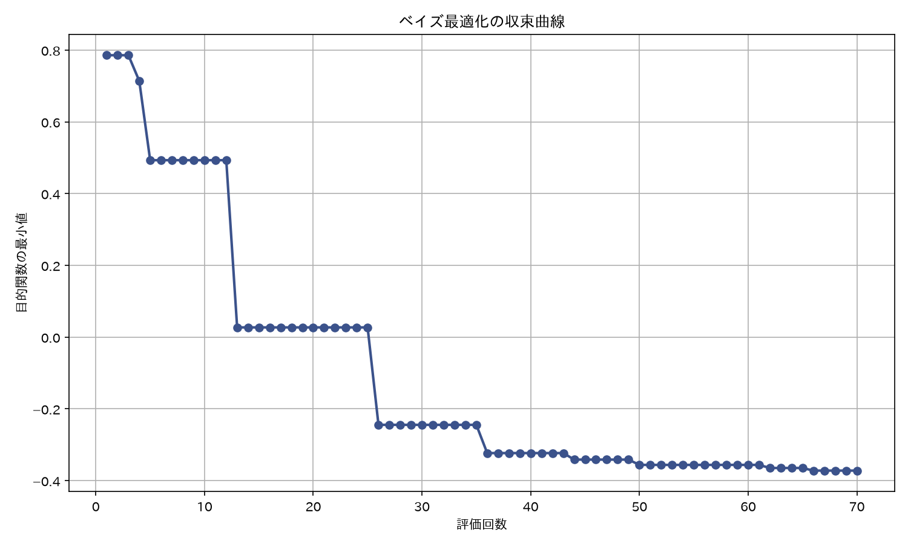
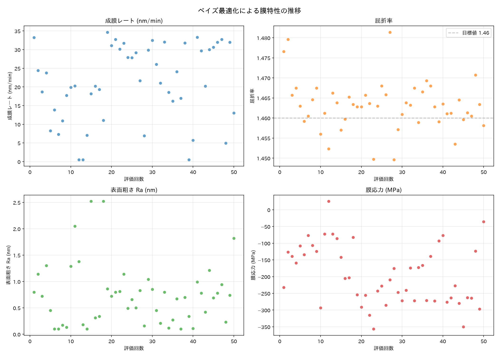
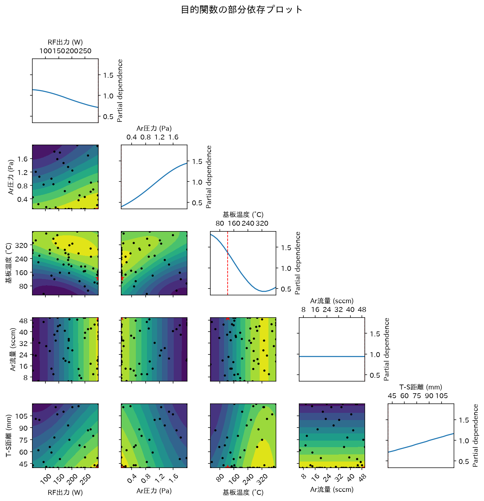

# スパッタ成膜条件ベイズ最適化 — 実行結果

## 作成したファイル

| ファイル | 説明 |
|---------|------|
| [pyproject.toml](pyproject.toml) | プロジェクト定義・uv依存関係管理 |
| [generate_dataset.py](generate_dataset.py) | 合成データセット生成（物理的傾向を反映したシミュレーション関数） |
| [bayesian_optimization.py](bayesian_optimization.py) | ベイズ最適化メインスクリプト（scikit-optimize使用） |
| [requirements.txt](requirements.txt) | 依存パッケージ (pip用互換) |
| [README.md](README.md) | 使い方・カスタマイズガイド |

## 探索空間と目的関数

**5つの成膜パラメータ**（RF出力、Ar圧力、基板温度、Ar流量、T-S間距離）を入力として、**4つの膜特性**（成膜レート、屈折率、表面粗さ、膜応力）を重み付きスカラースコアに統合して最適化しています。

## 最適化結果

初期実験データ 20点を活用し、50回の評価（ガウス過程 + EI獲得関数）で最適条件を探索しました。

**発見された最適条件:**

| パラメータ | 最適値 |
|-----------|-------|
| RF出力 | 300 W |
| Ar圧力 | 0.10 Pa |
| 基板温度 | 400 °C |
| Ar流量 | 50.0 sccm |
| T-S間距離 | 40 mm |

**予測膜特性（10回平均 ± σ）:**

| 特性 | 値 |
|------|-----|
| 成膜レート | 26.13 ± 0.98 nm/min |
| 屈折率 | 1.4815 ± 0.0034 |
| 表面粗さ Ra | 0.82 ± 0.10 nm |
| 膜応力 | −77.3 ± 15.9 MPa |

## 収束曲線

目的関数の最小値が評価回数とともに改善していく様子です。初期データ 20点の後、BO が効率的に最適領域を探索しています。

## 膜特性の推移

各評価での膜特性の推移。後半では高い成膜レート・低い表面粗さの領域に集中して探索していることがわかります。

## 部分依存プロット

ガウス過程モデルが学習したパラメータ間の関係性。対角線は各パラメータの単独効果、非対角は2パラメータ間の交互作用を示します。

## カスタマイズポイント

- **実験データの利用**: 自分のデータを CSV 形式で `--initial-data` に指定可能
- **目的関数の重み**: [bayesian_optimization.py](bayesian_optimization.py#L56-L61) の `WEIGHTS` を変更
- **膜材料の変更**: [generate_dataset.py](generate_dataset.py) の `simulate_deposition()` を実際の実験モデルに置き換え
- **獲得関数**: `--acq-func` で EI / PI / LCB / gp_hedge を切り替え
